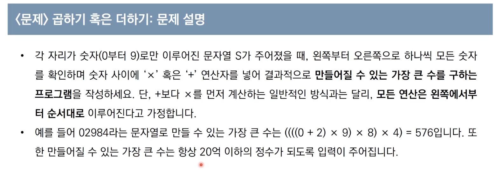

## Greedy Algorithm

### 그리디 알고리즘이란?

- 탐욕법이라고도 하며 현재 상황에서 지금 당장 좋은 것만 고르는 방법

### 간단 예시

- 최적해는 5 -> 7 -> 9 이지만
- 그리디 알고리즘을 사용하면 5 -> 10 -> 4가 선택된다
- 다음과 같이 최적의 해를 보장하지 못하는 경우가 많다.
- 최적의 해를 얻을 수 있음을 추론할 수 있을 때만 사용.

### 그리디 알고리즘 사용 문제

1. 거스름돈 문제 - 큰 단위가 항상 작은 수의 배수여서 때문에 사용 가능
   

### 시간 복잡도

- 시간 복잡도는 화폐의 종류가 K라고 할 때 O(K)가 된다.
- 동전 종류에만 영향을 받는다.

### 예시 문제 1

### 예시 문제 2

