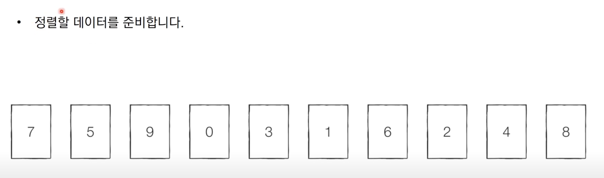
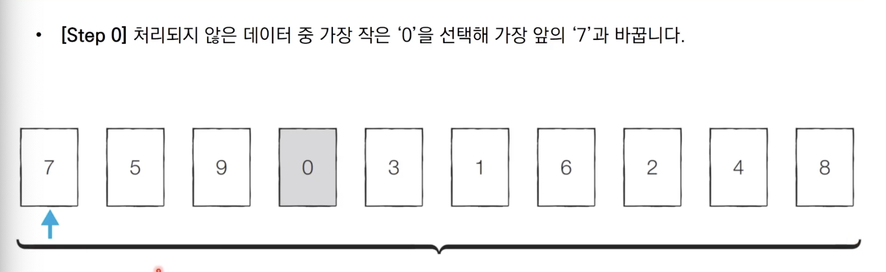
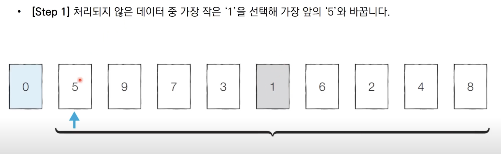
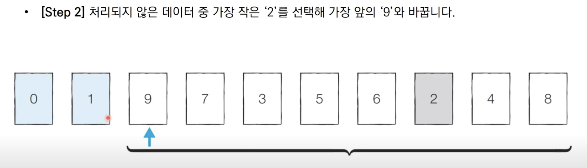
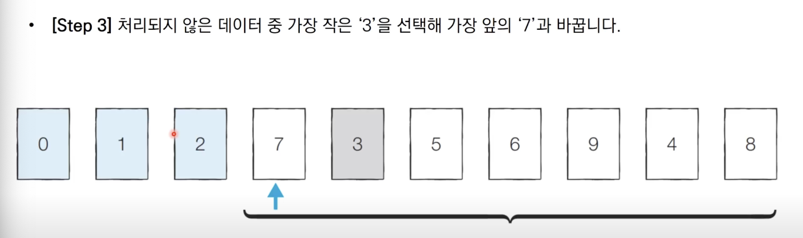
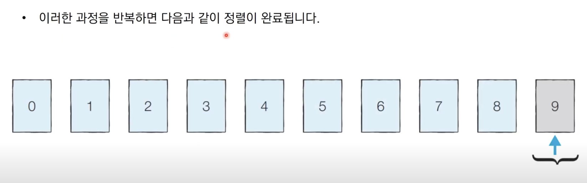
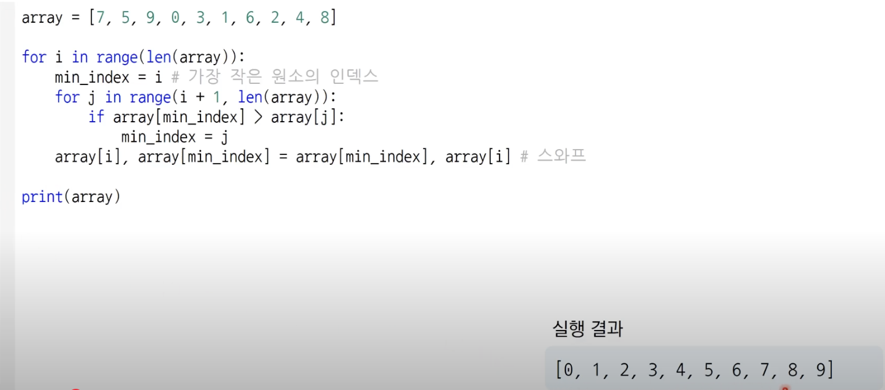

## 선택정렬

### 선택정렬 알고리즘이란?

- 처리되지 않은 데이터 중에서 가장 작은 데이터를 선택해 맨 앞에 있는 데이터와 바꾸는 것을 반복

### 간단 예시

### 선택정렬 소스 코드 (Python)

### 선택 정렬 시간 복잡도

- N번 만큼 가장 작은 수를 찾아서 맨 앞으로 보내야 합니다.
- 구현 방식에 따라서 사소한 오차는 있을 수 있지만, 보통 전체 연산 횟순느
- N + (N+1) + (N+2) + .... + 2 입니다
- 이는 (N^2 + N - 2) / 2 로 표현할 수 있는데, 빅오 표기법에 따라서 O(N^2)이라고 작성합니다.
