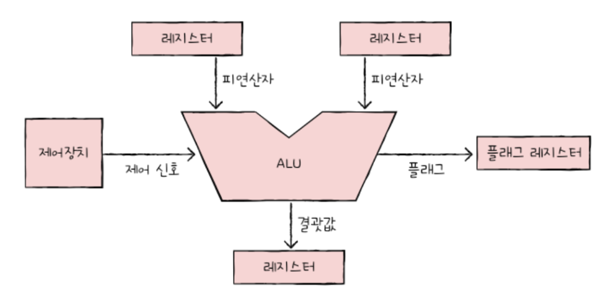
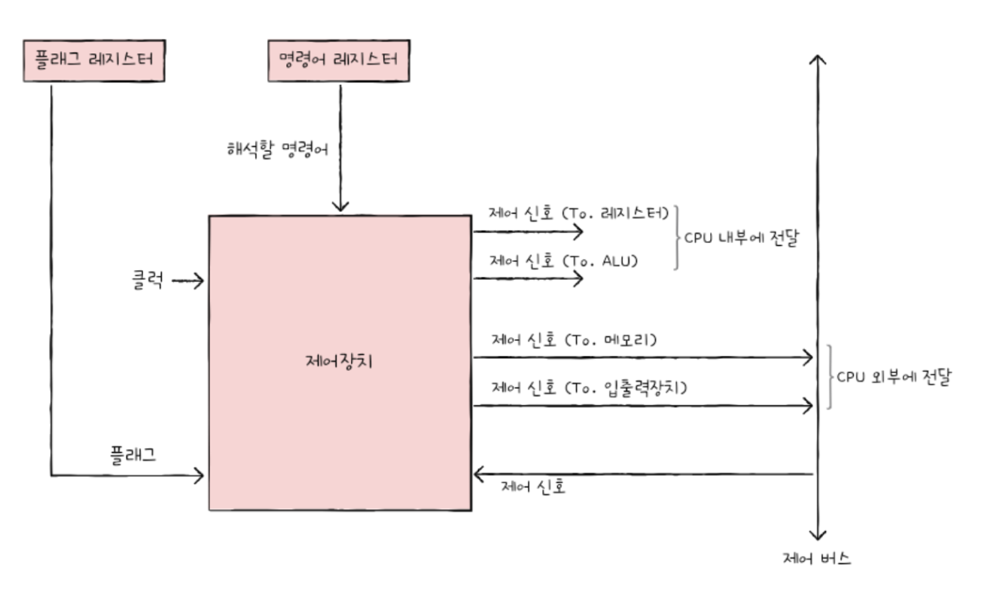
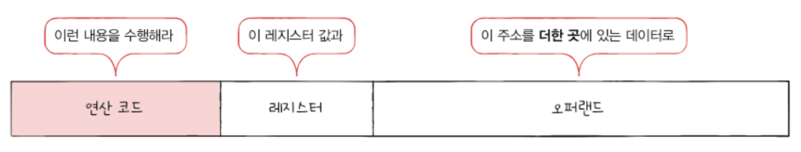
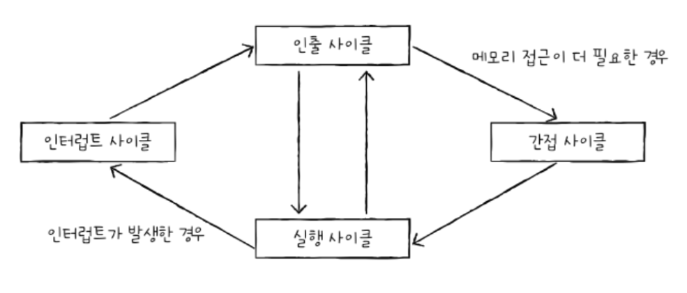

# 04-1 ALU와 제어장치

## ALU

- ALU 내부에는 여러 계산을 위한 회로 존재
	- 가산기 for 덧셈
	- 보수기 for 뺄셈
	- 시프터 for 시프트 연산
	- 오버플로우 검출기 for 오버플로우 대비

### ALU가 받아들이는 정보
- 피연산자 from 레지스터
- 제어 신호(수행할 연산) from 제어장치

### ALU가 내보내는 정보
- 연산 결과 to 레지스터
	- 레지스터에 접근하는 것이 메모리에 접근하는 것보다 빠르기 때문에 레지스터에 우선 저장
	- 연산 결과는 숫자 or 문자 or 메모리 주소
- 플래그 (연산 결과에 대한 추가적인 상태 정보) to 플래그 레지스터

| 플래그 종류    | 의미                                  | 사용 예시                                   |
| --------- | ----------------------------------- | --------------------------------------- |
| 부호 플래그    | 연산한 결과의 부호를 나타낸다.                   | - 1 → 음수 - 0 → 양수                    |
| 제로 플래그    | 연산 결과가 0인지 여부를 나타낸다.                | - 1 → 0 - 0 → 1                      |
| 캐리 플래그    | 연산 결과 올림수나 반올림 수가 발생했는지를 나타낸다.      | - 1 → 올림수나 빌림수 O - 0 → 올림수나 빌림수 X    |
| 오버플로우 플래그 | 오버플로우가 발생했는지를 나타낸다.                 | - 1 → 오버플로우 O - 0 → 오버플로우 X          |
| 인터럽트 플래그  | 인터럽트가 가능한지를 나타낸다.                   | - 1 → 인터럽트 가능 - 0 → 인터럽트 불가          |
| 슈퍼바이저 플래그 | 커널 모드로 실행중인지, 사용자 모드로 실행 중인지를 나타낸다. | - 1 → 커널 모드로 실행 중 - 0 → 사용자 모드로 실행 중 |

## 제어장치

- **제어장치**: 제어 신호를 내보내고, 명령어를 해석하는 부품
- **제어 신호**: 컴퓨터 부품들을 관리하고 작동시키기 위한 일종의 전기 신호

### 제어장치가 받아들이는 정보
- 클럭 신호
	- 클럭: 컴퓨터의 모든 부품을 움직일 수 있게 하는 시간 단위
	- 클럭의 주기에 맞춰 한 레지스터에서 다른 레지스터로 데이터가 이동되거나, ALU에서 연산이 수행되거나, CPU가 메모리에 저장된 명령어를 읽어 들인다.
	- 하나의 명령어가 여러 클럭에 걸쳐 실행될 수 있다. (컴퓨터의 모든 부품이 한 클럭마다 작동하는 것은 아님)
- 해석해야 할 명령어
	- 명령어 레지스터로부터 해석할 명령어를 받아들이고 해석해서 제어 신호를 발생시킨다.
- 플래그 값
	- 플래그 레지스터에서 플래그 값을 받아들이고 이를 참고하여 제어 신호를 발생시킨다.
- 제어 신호
	- 입출력장치를 비롯한 CPU 외부 장치로부터 제어 버스를 통해 전달된 제어 신호를 받아들인다.

### 제어장치가 내보내는 정보
- CPU가 외부에 전달하는 제어 신호 (= 제어 버스로 제어 신호를 내보낸다)
	- 메모리에 전달하는 제어 신호
	- 입출력장치(보조기억장치 포함)에 전달하는 제어 신호
- CPU 내부에 전달하는 제어 신호
	- ALU에 전달하는 제어 신호 (for 수행할 연산을 지시)
	- 레지스터에 전달하는 제어 신호 (for 레지스터 간 데이터 이동, 레지스터에 저장된 명령어 해석)

--- 

# 04-2 레지스터

- CPU 내부의 작은 임시저장장치
- 프로그램 속 명령어 & 데이터는 실행 전후로 레지스터에 저장

## 반드시 알아야 할 레지스터

### 프로그램 카운터 (PC: Program Counter)
- 메모리에서 읽어 들일 명령어의 주소 저장
- 명령어 포인터 (IP: Instruction Pointer)라고 부르기도 한다.
- 프로그램 카운터가 1씩 증가하면서 프로그램을 순차적으로 실행된다.
	- 순차적인 실행 흐름이 끊기는 경우
		- 특정 메모리 주소로 실행 흐름을 이동하는 명령어(JUMP, CONDITIONAL JUMP, CALL, RET 등) 실행 시
		- 인터럽트 발생 시

### 명령어 레지스터
- 해석할 명령어(방금 메모리에서 읽어 들인 명령어)를 저장
- 제어장치가 명령어 레지스터 속 명령어를 받아들여서 해석한 뒤 제어 신호를 내보낸다.

### 메모리 주소 레지스터
- CPU가 읽어 들이고자 하는 주소 값을 주소 버스로 보낼 때 해당 메모리 주소를 저장

### 메모리 버퍼 레지스터
- 메모리와 주고받을 값(데이터와 명령어)을 저장

### 범용 레지스터
- 다양하고 일반적인 상황에서 자유롭게 사용
- 데이터와 주소를 모두 저장 가능

### 플래그 레지스터
- ALU의 연산 결과 또는 CPU 상태에 대한 부가 정보 저장

### 스택 포인터
- 스택 주소 지정 방식에 사용
- 스택에 마지막으로 저장한 값의 위치를 저장 (스택 최상단의 위치 저장)
- 스택의 어디까지 데이터가 채워져 있는지에 대한 표시
- 스택은 메모리 안의 스택 영역에서 사용

### 베이스 레지스터
- 변위 주소 지정 방식에 사용
- 기준 주소  저장

## 특정 레지스터를 이용한 주소 지정 방식(1): 스택 주소 지정 방식
- 스택과 스택 포인터를 이용한 주소 지정 방식

## 특정 레지스터를 이용한 주소 지정 방식(2): 변위 주소 지정 방식
- 오퍼랜드 필드의 값을 변위로 삼음
- 오퍼랜드 필드의 값과 특정 레지스터(프로그램 카운터 or 베이스 레지스터)의 값을 더하여 유효 주소를 얻어내는 주소 지정 방식
- 변위 주소 지정 방식을 사용하는 명령어는 연산 코드 필드, 레지스터 필드, 오퍼랜드 필드로 구성되어 있다.
  
- 오퍼랜드 필드의 주소와 어떤 레지스터를 더하는지에 따라 **상대 주소 지정 방식**, **베이스 레지스터 주소 지정 방식** 등으로 나뉜다.

### 상대 주소 지정 방식
- 오퍼랜드와 프로그램 카운터의 값을 더하여 유효 주소를 얻는 방식
	- 오퍼랜드가 -3이었다면 프로그램 카운터에 저장된 읽어 들이기로 했던 명령어의 세 번째 이전의 번지로 접근
	- 오퍼랜드가 3이었다면 프로그램 카운터에 저장된 읽어 들이기로 했던 명령어의 세 번째 이후의 번지로 접근
- 분기하여 특정 주소의 코드를 실행할 때 사용

### 베이스 레지스터 주소 지정 방식
- 오퍼랜드와 베이스 레지스터의 값을 더하여 유효 주소를 얻는 방식
	- `베이스 레지스터 == 기준 주소` , `오퍼랜드 == 기준 주소로부터 떨어진 거리`
	- 베이스 레지스터 200, 오퍼랜드 40이라면 200번지로부터 40만큼 떨어진 240번지로 접근

---

# 04-3 명령어 사이클과 인터럽트
 
## 명령어 사이클

- CPU에서 하나의 명령어가 처리되는 주기
- 인출 사이클, 실행 사이클, 간접 사이클, 인터럽트 사이클로 구성
- 프로그램을 이루는 수많은 명령어는 일반적으로 인출과 실행 사이클을 반복하며 실행

### 인출 사이클
- 메모리에 있는 명령어를 CPU로 가지고 오는 단계

### 실행 사이클
- CPU로 가져온 명령어를 실행하는 단계
- 제어장치가 명령어 레지스터에 담긴 값을 해석하고, 제어 신호를 발생시키는 단계

### 간접 사이클
- 명령어를 인출하여 CPU로 가져왔더라도 곧바로 실행할 수 없는 경우 (메모리 접근이 더 필요한 경우)에 수행
- 예를 들어 간접 주소 지정 방식에서 명령어를 실행하기 위해 메모리 접근을 한 번 더 해야 한다.

## 인터럽트
- CPU의 정상적인 작업을 방해하는 신호
- CPU가 먼저 처리해야 할 다른 작업이 생겼을 때 발생

### 동기 인터럽트 (= 예외)
- CPU에 의해 발생
- CPU가 명령어들을 수행하다가 예상치 못한 상황에 마주쳤을 때 발생
- CPU가 실행하는 프로그래밍 상의 오류와 같은 예외적인 상황에 마주쳤을 때 발생

### 동기 인터럽트(예외)의 종류
- 폴트: 예외를 처리한 직후 예외가 발생한 명령어부터 실행을 재개하는 예외
	- ex. 명령어 실행에 필요한 데이터가 메모리가 아닌 보조기억장치에 존재하는 경우, CPU는 폴트 발생시킨 후 보조기억장치로부터 필요한 데이터를 메모리로 가지고온 이후에 폴트가 발생한 그 명령어부터 실행
- 트랩: 예외를 처리한 직후 예외가 발생한 명령어의 다음 명령어부터 실행을 재개하는 예외
	- ex. 디버깅 (프로그램을 중단시키고 디버깅이 끝나면 프로그램은 다음 명령어부터 실행을 이어나감)
- 중단: 실행 중인 프로그램을 강제로 중단시킬 수밖에 없는 심각한 오류를 발견했을 때
- 소프트웨어 인터럽트: 시스템 호출이 발생했을 때

### 비동기 인터럽트 (= 하드웨어 인터럽트)
- 입출력 장치에 의해 발생
- 알림 역할을 함
- 하드웨어 인터럽트를 사용하지 않는다면
	- CPU가 주기적으로 입출력장치의 완료 여부를 확인해야 한다. ⇒ CPU 사이클 낭비
- 하드웨어 인터럽트를 사용하면
	- CPU는 완료 인터럽트를 받을 때까지 다른 작업 처리 가능 ⇒ 입출력 작업 도중에도 효율적으로 명령어 처리 가능
- 예시
	- CPU가 프린터에 입출력 작업을 부탁하면 작업을 끝낸 프린터가 CPU에 완료 알림(인터럽트)를 보낸다.
	- 키보드, 마우스와 같은 입출력 장치가 어떠한 입력을 받아들였을 때 이를 처리하기 위해 CPU에 입력 알림(인터럽트)를 보낸다.

### 하드웨어 인터럽트 처리 순서
1. 입출력장치가 CPU에 **인터럽트 요청 신호**를 보낸다.
2. CPU는 실행 사이클이 끝나고 명령어를 인출하기 전 항상 인터럽트 여부 확인
3. CPU는 **인터럽트 플래그**를 통해 현재 인터럽트를 받아들일 수 있는지 여부 확인
	-  인터럽트 플래그가 불가능으로 설정되어 있다면 CPU는 인터럽트 요청이 오더라도 해당 요청 무시
	- 모든 인터럽트를 인터럽트 플래그로 막을 수 있는 것은 아니다. (ex. 정전, 하드웨어 고장)
4. 인터럽트를 받아들일 수 있다면 CPU는 지금까지의 작업을 **백업**
	- 프로그램 카운터 값 등 현재 프로그램을 재개하기 위해 필요한 모든 내용을 스택에 백업
5. CPU는 **인터럽트 백터**를 참조하여 **인터럽트 서비스 루틴**을 실행
	- 인터럽트 서비스 루틴의 시작 주소가 위치한 곳으로 프로그램 카운터 값을 갱신하고 인터럽트 서비스 루틴을 실행
6. **인터럽트 서비스 루틴** 실행이 끝나면 백업해 둔 작업을 복구하여 실행 재개

- **인터럽트 요청 신호**
	- CPU의 작업을 방해하는 인터럽트에 대한 요청
- **인터럽트 플래그**
	- 인터럽트 요청 신호를 받아들일지 무시할지를 결정하는 비트
	- CPU가 중요한 작업을 처리해야 하거나 어떤 방해도 받지 않아야 할 때 인터럽트 플래그를 불가능으로 설정
- **인터럽트 서비스 루틴**
	- 인터럽트를 처리하는 프로그램 (메모리에 저장되어 있다)
	- 어떤 인터럽트가 발생했을 때 해당 인터럽트를 어떻게 처리하고 작동해야 할지에 대한 정보로 이루어진 프로그램
	- CPU가 인터럽트를 처리한다 = 인터럽트 서비스 루틴을 실행하고 본래 수행하던 작업으로 다시 되돌아온다
	- 입출력장치마다 각기 다른 인터럽트 서비스 루틴을 가지고 있다.
- **인터럽트 벡터**
	- 인터럽트 서비스 루틴을 식별하기 위한 정보
	- 인터럽트 서비스 루틴의 시작 주소를 포함
	- CPU는 하드웨어 인터럽트 요청을 보낸 대상으로부터 데이터 버스를 통해 인터럽트 벡터를 전달받는다.

 
 
출처: 혼자 공부하는 컴퓨터구조+운영체제
