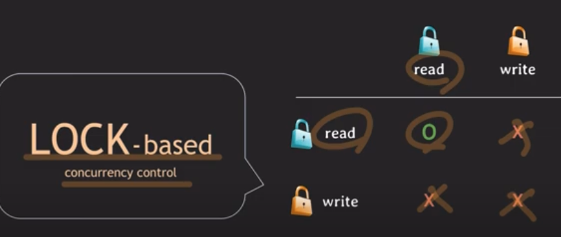

## 개요

지난 번 lock에 대해서 알아보고자 했었습니다. 이 번에는 MVCC를 쉬운 코드라는 유튜버의 영상을 이용해 정리해보았습니다. 궁극적으로는 실무에서 어떤 경우에 어떤 방법을 채택하는지 알아보고자 합니다. 이 부분은 아직 자료 찾는 중입니답

## 목표

1. MVCC 이해하기
2. DBMS마다 다른 MVCC 구현

## MVCC(Multi Version Concurrency Control)



장점 : 위처럼 MVCC를 사용하면 락을 사용하는 것보다 블락 발생이 적은 것을 확인할 수 있음 → 동시성 향상


- 데이터를 읽을 때 특정 시간 기준(isolation level에 따라 다름)으로 가장 최근 commit된 데이터를 읽음
    - READ COMMITED : 커밋된 시점으로 데이터를 읽음(위의 경우 T2의 의해 50을 읽게 되고, non-repeatable read 문제가 발생하게 됨)
    - REAPEATABLE READ : 트랜잭션 시작 시점으로 데이터를 읽음(위의 경우 T1 시작 시의 스냅샷을 이용해 10을 읽게 됨)
- write 이력을 관리 → 추가적인 저장 공간 사용
- read와 write가 서로 block하지 않음 → `x-lock`만 사용. 따라서 write-write의 경우에는 block이 발생

### READ UNCOMMITED?

MVCC는 커밋된 데이터만 읽기 때문에 보통 적용되지 않음.

### Postgresql?

`REPEATABLE READ에서 같은 데이터에 먼저 update한 트랜잭션이 커밋되면 나중 트랜잭션은 rollback됨` → 이를 통해 lost update와 non-repeatable read문제를 해결


### MySQL?

MySQL에서는 lost update를 해결하기 위해 Locking read라는 방식을 사용

쿼리 끝에 FOR UPDATE라는 명령문을 작성해주어야 함 → 개발자가 명시 필요

```sql
SELECT balance
FROM account
WHERE id = 'x'
FOR UPDATE;
```

이를 통해 read를 하면서 x-lock을 얻게 됨

문제는 locking read를 사용하면 그 트랜잭션에서는 REPEATABLE READ임에도 불구하고 최근의 커밋된 데이터를 읽게 됨

### 결론

DBMS마다 구현도 다르고, lost update 등 다양한 문제에 대해 해결 방법도 다른 것 같음. 이들을 모두 알 수 있지는 않아보임. 선택한 DB에 따라 필요에 따라 찾아서 사용하는 것이 좋아보였음

\*참고 : [쉬운 코드 MVCC - 1](https://www.youtube.com/watch?v=wiVvVanI3p4), [쉬운 코드 MVCC - 2](https://www.youtube.com/watch?v=-kJ3fxqFmqA)
