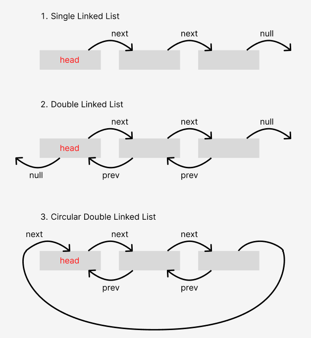
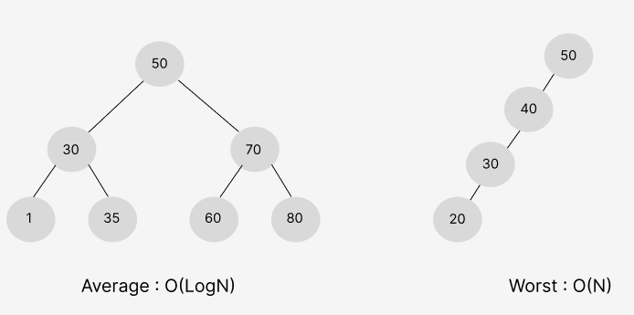
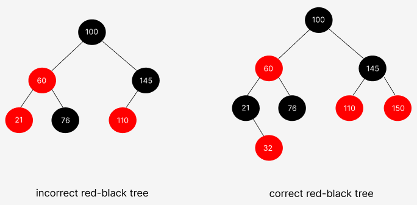
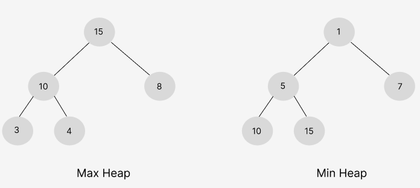

# 자료 구조
- 파이썬 기반 설명

# 1. 선형 자료 구조
선형 자료 구조란 요소가 일렬로 나열되어 있는 자료 구조를 말한다.

## 1. 연결 리스트
연결 리스트는 데이터를 감싼 노드를 포인터로 연결해서 공간적인 효율성을 극대화시킨 자료 구조이다. 삽입과 삭제가 O(1)이 걸리며 탐색에는 O(n)이 걸린다.

<br>



prev 포인터와 next 포인터로 앞과 뒤의 노드를 연결시킨 것이 연결 리스트이며, 연결 리스트는 싱글 연결 리스트, 이중 연결 리스트, 원형 이중 연결 리스트가 있다.
- 싱글 연결 리스트 : next 포인터만 가진다.
- 이중 연결 리스트 : next 포인터와 prev 포인터를 가진다.
- 원형 이중 인결 리스트 : 이중 연결 리스트와 같지만 마지막 노드의 next 포인터가 헤드 노드를 가리킨다.
이 중, Deque는 이중 연결 리스트를 이용하여 구현할 수 있다.
```angular2html
from collections import deque

d = deque()

# append : 덱의 오른쪽에서 요소 삽입
for i in range(5):
	d.append(i) # deque([0, 1, 2, 3, 4])

# appendleft : 덱의 왼쪽에서 요소 삽입
d.appendleft(10) # deque([10, 0, 1, 2, 3, 4])

# insert : 덱 중간에 요소 삽입
d.insert(1, 0) # deque([0, 0, 1, 2, 3, 4])

# pop : 스택처럼 덱의 오른쪽에서 요소 삭제
d.pop() # deque([0, 0, 1, 2, 3])

# popleft : 큐처럼 덱의 왼쪽에서 요소 삭제
d.popleft() # deque([0, 1, 2, 3])
```

## 2. 배열
배열은 같은 타입의 변수들로 이루어져 있다. 정적 배열은 크기가 정해져 있으며, 인접한 메모리 위치에 있는 데이터를 모아놓은 집합이다. 또한, 중복을 허용하고 순서가 있다. 랜덤 접근이 가능하여 탐색은 O(1)이다. 삽입과 삭제는 O(n)이 걸린다. 따라서 데이터 추가와 삭제를 많이 하는 것은 연결 리스트, 탐색을 많이 하는 것은 배열로 하는 것이 좋다.
파이썬에서 배열은 list라고 한다.
```angular2html
lst = [1, 2, 3]
lst[0] # 1
lst[-1] # 3
```

## 3. 벡터
벡터는 동적으로 요소를 할당할 수 있는 동적 배열이다. 컴파일 시점에 개수를 모른다면 벡터를 써야 한다. 또한, 중복을 허용하고 순서가 있고 랜덤 접근이 가능하다. 탐색과 맨 뒤의 요소를 삭제하거나 삽입하는 데 O(1)이 걸리며, 맨 뒤나 맨 앞이 아닌 요소를 삭제하고 삽입하는 데 O(n)의 시간이 걸린다.
파이썬은 list가 동적 배열이다. 상황에 맞게 배열의 크기가 조절되기 때문에 값을 맘대로 추가할 수 있다.
```angular2html
lst = [1, 2, 3]
lst.append(4) # [1, 2, 3, 4]
```
```angular2html
// c++ - vector

#include <vector>
#include <iostream>

using namespace std;
vector<int> v;

int main() {
  for (int i = 1; i <= 10; i++) v.push_back(i); // 1 2 3 4 5 6 7 8 9 10
  v. pop_back(); // 1 2 3 4 5 6 7 8 9
  
  v.erase(v.begin(), v.begin() + 1) // 2 3 4 5 6 7 8 9
  
  auto a = find(v.begin(), v.end(), 100);
  if (a == v.end()) cout << "not found" << "\n"; // not found
  
  fill(v.begin(), v.end(), 10); // 10 10 10 10 10 10 10 10
  v.clear(); // 배열 초기화
  
  return 0;
}
```

## 4. 스택
스택은 가장 마지막으로 들어간 데이터가 가장 첫 번째로 나오는 성질 LIFO(Last In First Out)을 가진 자료 구조이다. 재귀적인 함수, 알고리즘에 사용되며 웹 브라우저 방문 기록 등에 쓰인다. 삽입 및 삭제는 O(1), 탐색은 O(n)이 걸린다.
파이썬은 스택 자료 구조를 따로 제공하지 않는다. 다만 list를 스택처럼 사용할 수 있다.
```angular2html
# init
stack = [3]

# push
stack.append(4) # [3, 4]

# pop
top = stack.pop() # 요소 4 제거 및 반환

# top
top = stack[-1] # 요소 3 반환
```

## 5. 큐
큐는 먼저 집어넣은 데이터가 먼저 나오는 성질 FIFO(First In First Out)을 지닌 자료 구조이다. 나중에 집어넣은 데이터가 먼저 나오는 스택과는 반대되는 개념을 가졌다. 삽입 및 삭제는 O(1), 탐색은 O(n)이 걸린다.
파이썬으로 큐를 구현하는 방법은 대표적으로 두 가지가 있다. list를 사용하는 방법, queue 라이브러리를 사용하는 방법이다.
1. list로 구현
```angular2html
queue = []

# push
queue.append(0) # [0]
queue.append(1) # [0, 1]

# pop
del queue[0] # 요소 0 제거
queue.pop(0) # 요소 1 제거 및 반환
```

2. queue 라이브러리
```angular2html
import queue

queue = queue.Queue()

# push
queue.put(0) # [0]

# pop
queue.get() # 요소 0 제거 및 반환

# size 계산
queue.qsize() # 0
```

# 2. 비선형 자료 구조
비선형 자료 구조란 일렬로 나열하지 않고 자료 순서나 관계가 복잡한 구조를 말한다. 일반적으로 트리나 그래프를 말한다.

## 1. 이진 탐색 트리
이진 탐색 트리(BST)는 노드의 오른쪽 하위 트리에는 ‘노드 값보다 큰 값’이 있는 노드만 포함되고, 왼쪽 하위 트리에는 ‘노드 값보다 작은 값’이 들어 있는 트리를 말한다.
이때 왼쪽 및 오른쪽 하위 트리도 해당 특성을 가진다. 이렇게 두면 ‘검색’을 하기에 용이하다. 왼쪽에는 작은 값, 오른쪽에는 큰 값이 이미 정해져 있기 때문에 1을 찾으려고 한다면 50의 왼쪽 노드들만 찾으면 된다는 것은 자명하다.(왼쪽 그림 기준) 보통 요소를 찾을 때 이진 탐색 트리의 경우 O(logn)이 걸린다. 하지만 최악의 경우 O(n)이 걸린다.



## 2. AVL 트리
AVL 트리(Adelson-Velsky and Landis tree)는 앞서 설명한 최악의 경우 선형적인 트리가 되는 것을 방지하고 스스로 균형을 잡는 이진 탐색 트리이다. 두 자식 서브트리의 높이는 항상 최대 1만큼 차이 난다는 특징이 있다. 이진 탐색 트리는 선형적인 트리 형태를 가질 때 최악의 경우 O(n)의 시간 복잡도를 가진다. “이러한 최악의 경우를 배제하고 항상 균형 잡힌 트리로 만들자.”라는 개념을 가진 트리가 바로 AVL 트리이다. 탐색, 삽입 삭제 모두 시간 복잡도가 O(logn)이며 삽입, 삭제를 할 때마다 균형이 안 맞는 것을 맞추기 위해 트리 일부를 왼쪽 혹은 오른쪽으로 회전시키며 균형을 잡는다.

## 3. 레드 블랙 트리
레드 블랙 트리는 균형 이진 탐색 트리로 탐색, 삽입, 삭제 모두 시간 복잡도가 O(logn)이다. 각 노드는 빨간색 또는 검은색의 색상을 나타내는 추가 비트를 저장하며, 삽입 및 삭제 중에 트리가 균형을 
유지하도록 하는 데 사용된다. C++ STL의 set, multiset, map, multimap이 이 레드 블랙 트리를 이용하여 구현되어 있다.

<br>



“모든 리프 노드와 루프 노드는 블랙이고 어떤 노드가 레드이면 그 노드의 자식은 반드시 블랙이다.” 등의 규칙을 기반으로 균형을 잡는 트리이다.

## 4. 힙
힙은 완전 이진 트리 기반의 자료 구조이며,  최소힙과 최대힙의 두 가지가 있고 해당 힙에 따라 특정한 특징을 지킨 트리를 말한다. 삽입과 삭제는 O(logn), 최대/최소값 검색은 O(1)이 걸린다.
- 최대힙 : 루트 노드에 있는 키는 모든 자식에 있는 키 중에서 가장 커야 한다. 또한, 각 노드의 자식 노드와의 관계도 이와 같은 특징이 재귀적으로 이루어져야 한다.
- 최소힙 : 최소힙에서 루트 노드에 있는 키는 모든 자식에 있는 키 중에서 최소값이어야 한다. 또한, 각 노드의 자식 노드와의 관계도 이와 같은 특징이 재귀적으로 이루어져야 한다.

<br>



파이썬의 heapq 모듈은 최소 힙으로 구현되어 있다.
```angular2html
import heapq

heap = []
# 요소 추가
heapq.heappush(heap, 50) # [50]
heapq.heappush(heap, 10) # [10, 50]

# 가장 작은 요소를 힙에서 제거 및 반환
root = heapq.heappop(heap) # 10

# 가장 작은 요소 탐색
root = heap[0]

# 리스트를 힙으로 변환 가능
heap2 = [50, 10, 20]
heapq.heapify(heap2) # [10, 50, 20]
```
Heapify는 O(n)이 걸린다. 모든 노드를 순회하면서 부모 노드와 자식 노드 간의 힙 속성을 유지하는 과정을 거치기 때문이다.

<br>

최소 힙을 구현되어 있는 heapq 모듈을 최대 힙을 사용하기 위해서는 원소 값의 부호를 바꿔주면 된다.
```angular2html
items = [10, 50, 20]

# heapq 모듈은 튜플의 첫 번째 요소를 기준으로 정렬한다.
# 첫 번째 요소에 - 값, 두 번째 요소에 원래 값을 넣어주면 된다.
max_heap = []
for item in items:
	heapq.heappush(max_heap, (-item, item)) # [(-50, 50), (-10, 10), (-20, 20)]

max_item = heapq.heappop(max_heap)[1] # 50
```

## 5. 우선순위 큐
우선순위 큐는 우선순위 대기열이라고도 하며, 대기열에서 우선순위가 높은 요소가 우선순위가 낮은 요소보다 먼저 제공되는 자료 구조이다. 우선순위 큐는 힙을 기반으로 구현된다.

<br>

파이썬은 queue 내장 모듈에서 PriorityQueue를 제공하고 있다.
```angular2html
from queue import PriorityQueue

q = PriorityQueue()
q1 = PriorityQueue(maxsize = 8) # maxsize를 활용하여 크기 제한 가능

# 요소 추가
q.put(3) 
q.put(4) # [3, 4]

q1.put((1, "apple")) # (우선순위, 값)의 형태로 저장할 수 있다. 디폴트는 오름차순 정렬이다.

# 요소 삭제 및 반환
q.get() # 1
q1.get()[1] # (우선순위, 값)의 형태에서 값 반환
```

## 6. 맵
맵(map)은 특정 순서에 따라 키와 매핑된 값의 조합으로 형성된 자료 구조이다. 즉, key, value 형태로 제공되는 자료 구조로 key는 unique하여 중복을 허용하지 않는다.

<br>

파이썬에는 딕셔너리라는 HashMap이 존재한다.
해싱을 기반으로 구현되어 있기 때문에 삽입, 삭제, 탐색의 시간복잡도가 O(1)이다.
```angular2html
map = dict()
map["one"] = 1

for k, v in map.items():
	map[k] = v * 2

# key에 해당하는 값 삭제 & 그 값 반환
map.pop("one") # 2
```

<br>

C++의 map은 내부적으로 red-black tree로 구현되어 있다.
따라서 탐색, 삽입, 삭제 시간복잡도 모두 O(logn)이다.
```angular2html
// C++ - map

map<string, int> m;
m["one"] = 1;

for (auto p: m) {
	printf("%d, %d\n", p.first, p.second);
}
```

<br>

map에 객체를 저장하는  것과 동시에 키를 기준으로 자동 오름차순 정렬되는 TreeMap이 있다.
TreeMap은 red-black tree로 구현되어 있다.
따라서 탐색, 삽입, 삭제 시간복잡도 모두 O(logn)이다.
```angular2html
$ pip install sortedcontainers # 외장 라이브러리임

from sortedcontainers import SortedDict

map = SortedDict()
map["a"] = "apple"
map["b"] = "banana"

map.pop("a")
```

## 7. 셋
셋(set)은 특정 순서에 따라 고유한 요소를 저장하는 컨테이너이며, 중복되는 요소는 없고 오로지 unique한 값만 저장하는 자료 구조이다.

<br>

파이썬의 set은 HashSet으로 구현되어 있다. 해싱을 기반으로 하기 때문에 탐색, 삽입, 삭제의 시간 복잡도가 모두 O(1)이다. 하지만 순서가 없고 집합 안에서는 unique한 값을 가진다.
set()의 원소로 들어올 수 있는 자료형은 immutable한 자료형, 즉 변동할 수 없는 자료형만 해당된다. int, char, tuple은 가능하지만 list, dict는 원소가 될 수 없다.
```angular2html
s1 = set([1, 2, 3]) # {1, 2, 3}
s2 = set("hello") # {'o', 'h', 'l', 'e'}
s1.add(4) # {1, 2, 3, 4}
s1.remove(1) # {2, 3, 4}

s3 = set([3, 4])
# 교집합
print(s1 & s3) or print(s1.intersection(s3)) # {3, 4}
# 합집합
print(s1 | s3) or print(s1.union(s3)) # {2, 3, 4}
# 차집합
print(s1 - s3) or print(s1.difference(s3)) # {2}
```

<br>

TreeMap과 유사하게, sortedcontainers 라이브러리에서는 중복되지 않는 값을 저장하고 값을 기준으로 자동 정렬하는 TreeSet을 제공한다. TreeSet 또한 탐색, 삽입, 삭제 시간 복잡도는 O(logn)이다.
```angular2html
from sortedcontainers import SortedSet

s = SortedSet()

s.add(1)
s.add(2)
s.add(3)

# 1보다 같거나 큰 최초 숫자의 위치(인덱스)
print(s.bisect_left(1)) # 0
# 1보다 큰 최초 숫자의 위치
print(s.bisect_right(1)) # 1
```