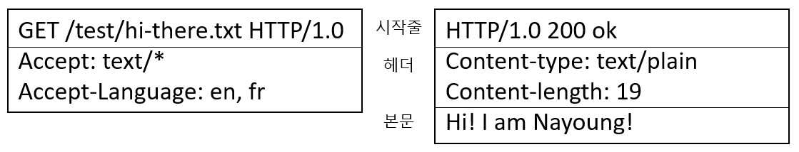

> 참고자료 : HTTP 완벽 가이드 - 웹은 어떻게 동작하는가

# 1장 HTTP 개관

## 1. HTTP

- HTTP : Hypertext Transfer Protocol
- World Wide Web 의 기본 요소 : HTTP 클라이언트 / HTTP 서버
  - HTTP 프로토콜을 통해 통신

## 2. 리소스

- 웹 서버 : 리소스 관리 및 제공

1. 미디어 타입 MIME : Multipurpose Internet Mail Extensions
   - 멀티미디어 콘텐츠를 기술 & 개발 가능
   - 웹 서버 : HTTP obj 에 MIME 타입 붙임 -> 다룰 수 있는 객체인지 확인
   - e.g. `text/html` HTML 문서, `image/jpeg` JPEG 이미지 등
2. URI : Uniform Resource Identifier
   - 각 웹 서버 리소스 이름
   - 클라이언트가 URI 를 통해 특정 리소스에 접근 가능
     `http://www.joes-hw.com/specials/saw-blade.gif`
     - scheme `http://` : HTTP protocol
     - internet addr of server `www.joes-hw.com` : www.joes-hw.com 으로 이동
     - resource in server `/specials/saw-blade.gif` : /specials/saw-blade.gif 라고 불리는 리소스 지칭
3. URL : Uniform Resource Locator
   - 리소스 식별자의 흔한 형태
   - 특정 서버의 한 리소스에 대한 구체적 위치
   - 오늘날, URI == URL

## 3. 트랜잭션

- HTTP 트랜잭션 = HTTP 요청 (c -> s) + HTTP 응답 (s -> c)

1. HTTP 메서드
   - 1 method in 1 HTTP request msg
     - GET : s -> c 로 지정 리소스 보내줘
     - PUT : c -> s 인 데이터를 지정한 이름의 리소스로 저장해조
     - DELETE : 지정한 리소스를 s 에서 삭제해조
     - POST : c data 를 s gateway app 으로 보내조
     - HEAD : 지정한 리소스에 대한 응답에서 HTTP header 만 조
2. 상태 코드
   - 상태 코드 in 모든 HTTP response
   - c 의 요청에 대한 반응
   - 상태 코드 & resson phrase
     - 200 OK
     - 200 Document attached
3. 대량의 트랜잭션 수행
   - 웹 페이지 == 리소스의 모음집

## 4. 메시지

