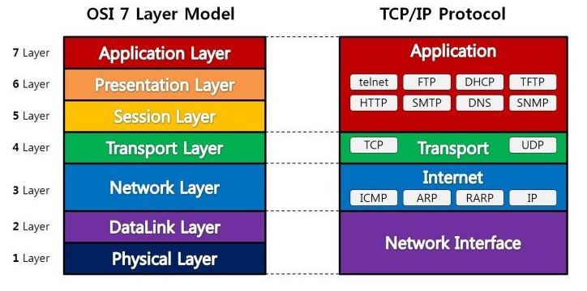
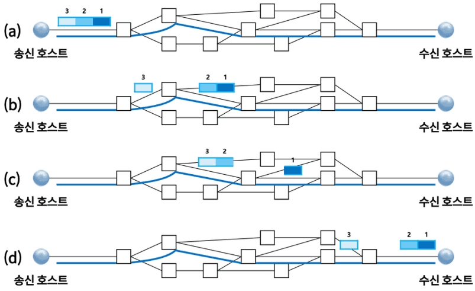
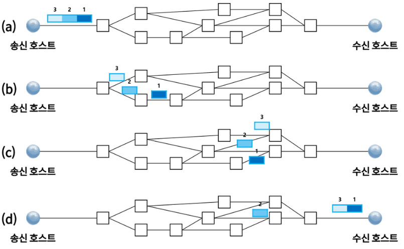
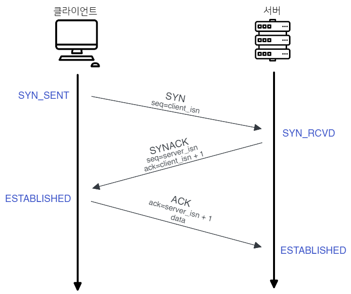
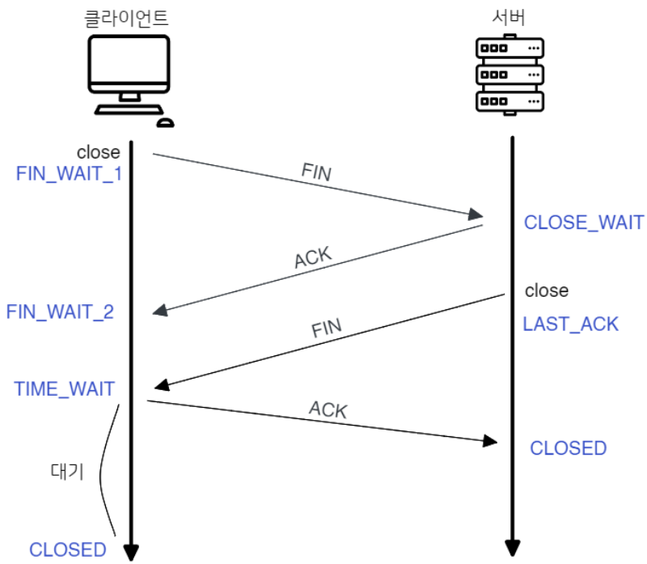
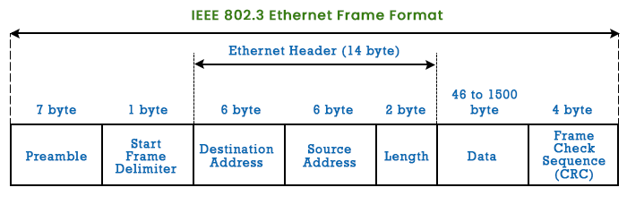
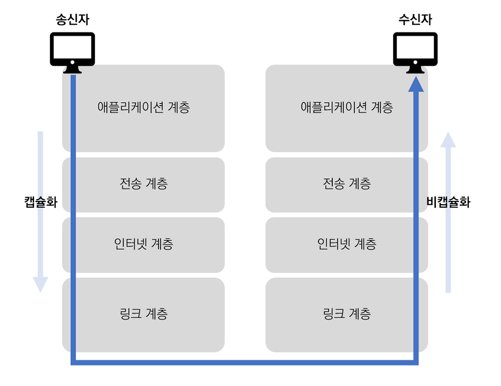
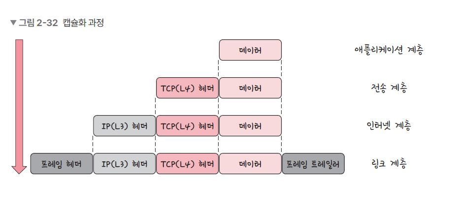
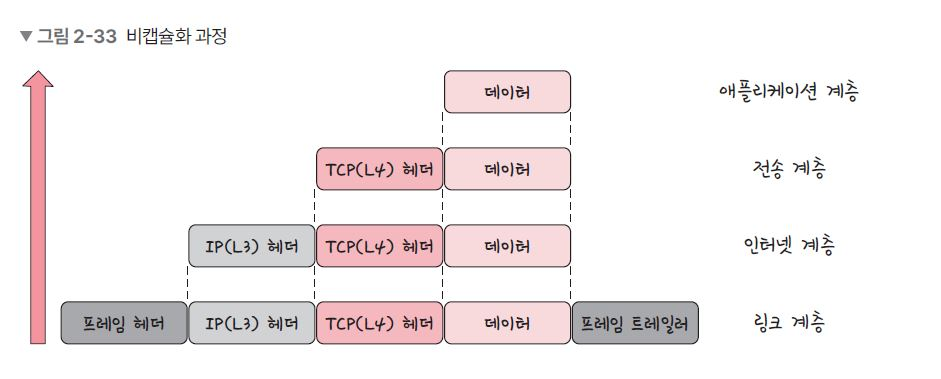

# TCP/IP 4계층 모델

## 1. 계층 구조
TCP/IP 계층은 네 개의 계층을 가지고 있으며 OSI 7계층과 많이 비교한다.

TCP/IP 계층과 달리 OSI 계층은 애플리케이션 계층을 세 개로 쪼개고 링크 계층을 데이터 링크 계층, 물리 계층으로 나눠서 표현하는 것이 다르며, 인터넷 계층을 네트워크 계층으로 부른다는 점이 다르다.
이 계층들은 특정 계층이 변경되었을 때 다른 계층이 영향을 받지 않도록 설계되었다. 예를 들어 전송 계층에서 TCP를 UDP로 변경했다고 해서 인터넷 웹 브라우저를 다시 설치해야 하는 것은 아니듯 유연하게 설계되었다.

지금부터 애플리케이션 계층부터 하나씩 살펴보자.

 

## 2. 애플리케이션 계층
애플리케이션(application) 계층은 FTP, HTTP, SSH, SMTP, DNS 등 응용 프로그램이 사용되는 프로토콜 계층이며 웹 서비스, 이메일 등 서비스를 실질적으로 사람들에게 제공하는 층이다.

- `FTP` : 장치와 장치 간의 파일을 전송하는 데 사용되는 표준 통신 프로토콜
- `SSH` : 보안되지 않은 네트워크에서 네트워크 서비스를 안전하게 운영하기 위한 암호화 네트워크 프로토콜
- `HTTP` : World Wide Web을 위한 데이터 통신의 기초이자 웹 사이트를 이용하는 데 쓰이는 프로토콜
- `SMTP` : 전자 메일 전송을 위한 인터넷 표준 통신 프로토콜
- `DNS` : 도메인 이름과 IP 주소를 매핑하는 서버, 예를 들어 `www.naver.com`에 DNS 쿼리가 오면 [Root DNS] → [.com DNS] → [.naver DNS] → [.www 
  DNS] 과정을 거쳐 완벽한 주소를 찾아 IP 주소를 매핑한다. 이를 통해 IP 주소가 바뀌어도 사용자에게 똑같은 도메인 주소로 서비스할 수 있다. 예를 들어 `www.naver.com`의 IP 주소가 
  222.111.222.111에서 222.111.222.122로 바뀌었음에도 똑같은 `www.naver.com`이라는 주소로 서비스가 가능하다.

 

## 3. 전송 계층
전송(transport) 계층은 송신자와 수신자를 연결하는 통신 서비스를 제공하며 연결 지향 데이터 스트림 지원, 신뢰성, 흐름 제어를 제공하며, 애플리케이션과 인터넷 계층 사이의 데이터가 전달될 때의 중개 역할을 한다. 대표적으로 TCP, UDP가 있다.
TCP는 패킷 사이의 순서를 보장하고 연결지향 프로토콜을 사용해서 연결을 하여 신뢰성을 구축해서 수신 여부를 확인하며 “가상회선 패킷 교환 방식”을 사용한다.
UDP는 순서를 보장하지 않고 수신 여부를 확인하지 않으며 단순히 데이터만 주는 “데이터그램 패킷 교환 방식”을 사용한다.

### 가상회선 패킷 교환 방식
가상회선 패킷 교환 방식은 각 패킷에는 가상회선 식별자가 포함되며 모든 패킷을 전송하면 가상회선이 해제되고 패킷들은 전송된 ‘순서대로’ 도착하는 방식을 말한다.

### 데이터그램 패킷 교환 방식
데이터그램 패킷 교환 방식이란 패킷이 독립적으로 이동하며 최적의 경로를 선택하여 가는데, 하나의 메시지에서 분할된 여러 패킷은 서로 다른 경로로 전송될 수 있으며 도착한 ‘순서가 다를 수’ 있는 방식을 뜻한다.

### TCP 연결 성립 과정
TCP는 신뢰성을 확보할 때 3-way handshake라는 작업을 진행한다.

위의 그림처럼 클라이언트와 서버가 통신할 때 세 단계의 과정을 거친다.
1. `SYN 단계` : 클라이언트는 서버에 클라이언트의 ISN을 담아 SYN을 보낸다. ISN은 새로운 TCP 연결의 첫 번째 패킷에 할당된 임의의 시퀀스 번호를 말하며 이는 장치마다 다를 수 있다.
2. `SYN + ACK 단계` : 서버는 클라이언트의 SYN을 수신하고 서버의 ISN을 보내며 승인번호로 클라이언트의 ISN + 1을 보낸다.
3. `ACK 단계` : 클라이언트는 서버의 ISN + 1한 값인 승인번호를 담아 ACK를 서버에 보낸다.
이렇게 TCP 3-way handshake 과정 이후 신뢰성이 구축되고 데이터 전송을 시작한다. 참고로 TCP는 이 과정이 있기 때문에 신뢰성이 있는 계층이라고 하며 UDP는 이 과정이 없기 때문에 신뢰성이 없는 계층이라고 한다.

### TCP 연결 해제 과정
TCP가 연결을 해제할 때는 4-way handshake 과정이 발생한다.

1. 먼저 클라이언트가 연결을 닫으려고 할 때 FIN으로 설정된 세그먼트를 보낸다. 그리고 클라이언트는 FIN_WAIT_1 상태로 들어가고 서버의 응답을 기다린다.
2. 서버는 클라이언트로 ACK라는 승인 세그먼트를 보낸다. 그리고 CLOSE_WAIT 상태에 들어간다. 클라이언트가 세그먼트를 받으면 FIN_WAIT_2 상태에 들어간다.
3. 서버는 ACK를 보내고 일정 시간 이후에 클라이언트에 FIN이라는 세그먼트를 보낸다.
4. 클라이언트는 TIME_WAIT 상태가 되고 다시 서버로 ACK를 보내서 서버는 CLOSED 상태가 된다. 이후 클라이언트는 어느 정도의 시가을 대기한 후 연결이 닫히고 클라이언트와 서버의 모든 자원의 연결이 해제된다.

이때, 클라이언트는 그냥 연결을 닫으면 되지 왜 TIME_WAIT이라는 일정 시간 뒤에 닫을까?
1. 지연 패킷이 발생할 경우를 대비하기 위함이다. 패킷이 뒤늦게 도달하고 이를 처리하지 못한다면 데이터 무결성 문제가 발생한다.
2. 두 장치가 연결이 닫혔는지 확인하기 위해서이다. 만약 LAST_ACK 상태에서 닫히게 되면 다시 새로운 연결을 하려고 할 때 장치는 줄곤 LAST_ACK로 되어 있기 때문에 접속 오류가 나타나게 될 것이다.

 

## 4. 인터넷 계층
인터넷(internet) 계층은 장치로부터 받은 네트워크 패킷을 IP 주소로 지정된 목적지로 전송하기 위해 사용되는 계층이다. IP, ARP, ICMP 등이 있으며 패킨을 수신해야 할 상대의 주소를 지정하여 데이터를 전달한다. 상대방이 제대로 받았는지에 대해 보장하지 않는 비연결형적인 특징을 가지고 있다.

 

## 5. 링크 계층
링크 계층은 전선, 광섬유, 무선 등으로 실질적으로 데이터를 전달하며 장치 간에 신호를 주고 받는 ‘규칙’을 정하는 계층이다. 참고로 네트워크 접근 계층이라고도 한다.
이를 물리 계층과 데이터 링크 계층으로 나누기도 하는데 물리 계층은 무선 LAN과 유선 LAN을 통해 0과 1로 이루어진 데이터를 보내는 계층을 말하며, 데이터 링크 계층은 ‘이더넷 프레임’을 통해 에러 확인, 흐름 제어, 접근 제어를 담당하는 계층을 말한다.

### 이더넷 프레임
데이터 링크 계층은 이더넷 프레임을 통해 전달받은 데이터의 에러를 검출하고 캡슐화하며 다음과 같은 구조를 가진다.

- `Preamble` : 이더넷 프레임이 시작임을 알린다.
- `SFD(Start Frame Delimiter)` : 다음 바이트부터 MAC 주소 필드가 시작됨을 알린다.
- `DMAC, SMAC` : 수신, 송신 MAC 주소를 말한다.
- `EtherType(Length)` : 데이터 계층 위의 계층인 IP 프롵콜을 정의한다. 예를 들어 IPv4 또는 IPv6가 된다.
- `Payload` : 전달받은 데이터
- `CRC` : 에러 확인 비트

**MAC 주소** : 컴퓨터나 노트북 등 각 장치에는 네트워크에 연결하기 위한 장치(LAN 카드)가 있는데, 이를 구별하기 위한 식별번호를 말한다. 6바이트(48비트)로 구성된다.

### 계층 간 데이터 송수신 과정
HTTP를 통해 웹 서버에 있는 데이터를 요청하면 어떤 일이 일어날까?

애플리케이션 계층에서 전송계층으로 필자가 보내는 요청(request) 값들이 캡슐화 과정을 거쳐 전달되고, 다시 링크 계층을 통해 해당 서버와 통신을 하고, 해당 서버의 링크 계층으로부터 애플리케이션까지 비캡슐화 과정을 거쳐 데이터가 전송된다.

### 캡슐화 과정
캡슐화 과정은 상위 계층의 헤더와 데이터를 하위 계층의 데이터 부분에 포함시키고 해당 계층의 헤더를 삽입하는 과정을 말한다.

애플리케이션 계층의 데이터가 전송 계층으로 전달되면서 ‘세그먼트’ 또는 ‘데이터그램’화되며 TCP(L4) 헤더가 붙여지게 된다. 그리고 이후 인터넷 계층으로 가면서 IP(L3) 헤더가 붙여지게 되며 ‘패킷’화가 되고, 이후 링크 계층으로 전달되면서 프레임 헤더와 프레임 트레일러가 붙어 ‘프레임’화가 된다.

### 비캡슐화 과정
비캡슐화 과정은 하위 계층에서 상위 계층으로 가며 각 계층의 헤더 부분을 제거하는 과정을 말한다.

이렇게 캡슐화된 데이터를 받게 되면 링크 계층에서부터 타고 올라오면서 프레임화된 데이터는 다시 패킷화를 거쳐 세그먼트, 데이터그램화를 거쳐 메시지화가 되는 비캡슐화 과정이 일어난다. 그 이후 최종적으로 사용자에게 애플리케이션의 PDU인 메시지로 전달된다.

### PDU
네트워크의 어떠한 계층에서 계층으로 데이터가 전달될 때 한 덩어리의 단위를 PDU(Protocol Data Unit)라고 한다.
PDU는  제어 관련 정보들이 포함된 ‘헤더’, 데이터를 의미하는 ‘페이로드’로 구성되어 있으며 계층마다 부르는 명칭이 다르다. 

- `애플리케이션 계층` : 메시지
- `전송 계층` : 세그머트(TCP), 데이터그램(UDP)
- `인터넷 계층` : 패킷
- `링크 계층` : 프레임(데이터 링크 계층), 비트(물리 계층)

예를 들어 애플리케이션 계층은 ‘메시지’를 기반으로 데이터를 전달하는데, HTTP의 헤더가 문자열인 것을 예로 들 수 있다.
참고로 PDU 중 아래 계층인 비트로 송수신하는 것이 모든 PDU 중 가장 빠르고 효율성이 높다. 하지만 애플리케이션 계층에서는 문자열을 기반으로 송수신을 하는데, 그 이유는 헤더에 authorization 값 등 다른 값들을 넣는 확장이 쉽기 때문이다.
